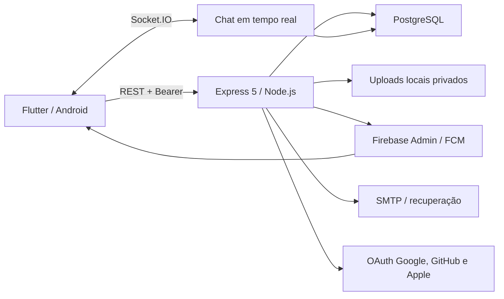

# Auditoria técnica completa — Conecta AMAUC

**Data:** 29/07/2026  
**Revisão auditada:** `72b6446` (`main`)  
**Escopo:** backend Node.js/Express, PostgreSQL, Flutter/Android, Firebase/FCM, APIs REST, WebSockets, autenticação, recuperação de senha, uploads e notificações.  
**Regra de execução:** análise não destrutiva. Nenhuma correção foi implementada e nenhum dado de produção foi removido.

## 1. Resumo executivo

O projeto está em bom estado funcional: compila para Android, inicia no emulador, conecta ao backend e ao PostgreSQL, inicializa o Firebase, recebe token FCM e conclui os fluxos básicos autenticados. As suítes automatizadas passaram integralmente e não há vulnerabilidades conhecidas nas dependências atualmente resolvidas.

Entretanto, o sistema **não deve ser publicado sem correções de segurança**. Foi confirmado um encadeamento crítico que permite a um cidadão cadastrar uma URL externa como foto de uma solicitação e fazer o aplicativo de outro usuário enviar o respectivo token Bearer ao domínio indicado quando a imagem for aberta. Também há riscos altos na recuperação de senha, no rate limit atrás de proxy e no script de seed.

### Resultado consolidado

| Severidade | Quantidade |
|---|---:|
| P0 — crítica | 1 |
| P1 — alta | 4 |
| P2 — média | 9 |
| P3 — baixa/manutenção | 3 |
| **Total** | **17** |

### Cinco riscos prioritários

1. **AUD-001 (P0):** exfiltração de token Bearer por URL de imagem controlada.
2. **AUD-002 (P1):** redefinir a senha não encerra sessões já existentes.
3. **AUD-003 (P1):** tokens de magic link/reset podem ser consumidos concorrentemente.
4. **AUD-004 (P1):** rate limit de refresh pode bloquear usuários em conjunto atrás do proxy.
5. **AUD-005 (P1):** seed destrutivo sem trava de ambiente e sem transação.

## 2. Metodologia, escopo e limitações

Foram inspecionados código-fonte, migrations, manifests Android, configuração de build/deploy, dependências, testes e histórico Git. Também foram realizados análise estática, testes unitários, compilação Android, instalação no emulador, leitura controlada do catálogo do PostgreSQL e smoke test autenticado.

Não foram executadas ações destrutivas. Em particular:

- o script E2E completo não foi executado porque cria e exclui registros;
- o seed não foi executado;
- as 22 migrations foram verificadas como aplicadas no banco atual, mas não houve replay em banco descartável;
- o envio real de e-mail não foi testado;
- a falha AUD-001 foi comprovada por fluxo de dados estático, sem enviar token a servidor externo;
- a topologia real de proxies e o fuso do ambiente Render não foram alterados para teste;
- testes de carga, pentest externo, dispositivos físicos e build assinado de release ficaram fora da execução não destrutiva.

Confiança global da auditoria: **alta para o código e ambiente local; média para comportamentos dependentes da infraestrutura de produção**.

## 3. Mapa de arquitetura

### Componentes principais

- `ca_backend/src/server.js`: bootstrap HTTP, CORS, Helmet, rotas e Socket.IO.
- `ca_backend/src/controllers`, `models`, `services`: regras da API, SQL e integrações.
- `ca_backend/migrations`: 22 migrations versionadas.
- `ca_frontend/lib/core`: configuração, rede, autenticação e serviços transversais.
- `ca_frontend/lib/data`: modelos, repositórios e acesso remoto.
- `ca_frontend/lib/presentation`: telas, widgets e estado Riverpod.
- `ca_frontend/android`: manifests e configuração Gradle.
- `render.yaml`: serviços de aplicação e banco no Render.

## 4. Inventário e configuração

- Aproximadamente 455 arquivos relevantes: 192 no backend, 247 no frontend e 10 de documentação.
- 86 arquivos de teste: 56 no backend e 30 no Flutter.
- Backend: Node.js `>=22`, Express 5, PostgreSQL, JWT, bcrypt, Multer, Socket.IO e Firebase Admin.
- Frontend: Flutter, Dio, Riverpod, Secure Storage, Firebase Core/Messaging, notificações locais e geolocalização.
- Banco observado: 18 tabelas públicas, 154 constraints e 22/22 migrations aplicadas.
- Deploy declarado no Render, região Oregon.
- Android release desabilita cleartext e backup; debug permite HTTP local.
- O build de release exige assinatura explícita e falha de propósito quando ela não está configurada.

O arquivo `ca_frontend/lib/firebase_options.dart` contém uma chave cliente Firebase, como é esperado em aplicativos Firebase. O valor foi omitido desta auditoria. A segurança depende de restrições corretas por pacote, SHA e API no Google Cloud.

## 5. Testes e validações executados

| Verificação | Resultado |
|---|---|
| `npm test -- --runInBand` | **55 suítes, 440/440 testes aprovados** |
| Cobertura backend | statements 80,55%; branches 71,84%; functions 96,05%; lines 82,16% |
| `npm audit --json` | **0 vulnerabilidades conhecidas** |
| `flutter analyze` | **nenhum problema** |
| `flutter test` | **67/67 testes aprovados** |
| `flutter build apk --debug` | **APK gerado com sucesso** |
| Instalação/abertura no emulador | **sucesso**, processo do app ativo |
| Firebase nativo | **inicializado**, token FCM recebido |
| Health da API e banco | **API e PostgreSQL disponíveis** |
| Smoke autenticado | login, perfil, categorias, profissionais, solicitações próprias e logout aprovados |
| Migrations no banco atual | **22/22 aplicadas** |
| Dependências Flutter | sem pacote atual marcado como descontinuado, retirado ou afetado por advisory |

Na primeira execução isolada, um teste de ambiente retornou `spawnSync.status = null` por restrição do sandbox. A repetição fora dessa restrição e a suíte completa passaram; portanto, **não houve teste funcional reprovado**.

## 6. Segurança

### Pontos positivos

- Access token curto e refresh token opaco armazenado como hash no banco.
- Middleware valida usuário ativo e sessão de refresh ainda válida.
- Logout revoga sessão e anonimização revoga todas as sessões.
- SQL majoritariamente parametrizado e transações usadas em fluxos importantes.
- Uploads usam nomes aleatórios, limites, validação de assinatura/estrutura e controle de acesso para evidências privadas.
- Helmet, validação de CORS em produção e guardas de configuração no bootstrap.
- Tokens do app são mantidos em armazenamento seguro, com migração do armazenamento legado.
- Rotas e testes cobrem papéis e vários cenários de IDOR.

### Riscos relevantes

O maior risco é o vazamento do Bearer para origem externa (AUD-001). Recuperação de senha e magic link usam armazenamento volátil e consumo não atômico; a troca de senha não revoga sessões. Em modo debug, o cliente registra corpos e respostas sensíveis. O controle de tentativas é local ao processo e depende de uma configuração de proxy não encontrada.

Não foram encontrados segredos privados completos rastreados no HEAD. Foram encontrados:

- chave cliente Firebase em arquivo de configuração do app — valor omitido;
- URLs de PostgreSQL em testes — fixtures, não credenciais reais;
- marcador de chave privada na documentação — placeholder.

Como uma chave cliente foi compartilhada fora do repositório durante a configuração, recomenda-se girá-la antes da publicação e validar as restrições Android para **certificados debug e release**, sem reutilizar a chave divulgada.

## 7. Backend e API

As rotas são organizadas por domínio e, em geral, aplicam autenticação e autorização nos pontos adequados. Há tratamento padronizado de erros, validação com Zod, paginação em listagens relevantes e separação razoável entre controllers, models e services.

Áreas que exigem atenção:

- schemas usam `passthrough()` e vários campos `any()`, permitindo propriedades não declaradas;
- textos não têm limites uniformes alinhados ao banco;
- o fluxo de recuperação é parcialmente implementado no controller e em memória;
- `SolicitacaoController.js` concentra muitas responsabilidades;
- o encerramento do servidor não trata sinais para drenar HTTP, sockets e pool.

### Matriz resumida de autorização

| Área | Proteção observada | Avaliação |
|---|---|---|
| Auth público | rate limit + validação | precisa das correções AUD-003/004/007/008 |
| Perfil próprio | Bearer + usuário da sessão | adequada |
| Solicitações | Bearer + checagens de papel/participante | boa, exceto entrada de `foto_url` |
| Admin | middleware de papel | adequada nos fluxos revisados |
| Chat/Socket | token no handshake e validação de participação | adequada |
| Uploads privados | Bearer e vínculo com usuário/solicitação | boa no download interno |
| Relatórios | admin | protegido, mas há erros de integridade/CSV |

## 8. Banco de dados

O esquema possui chaves estrangeiras, checks, índices, triggers e migrations transacionais em boa parte da evolução. O catálogo atual confirmou todas as migrations aplicadas.

### Achados de integridade e desempenho

- datas de negócio usam `TIMESTAMP` sem fuso;
- a solicitação não preserva diretamente a categoria contratada, impedindo relatório histórico confiável;
- algumas FKs usadas em joins/filtros não têm índice iniciando pela coluna correspondente;
- a migration inicial e o `schema.sql` devem continuar sincronizados, mas a fonte de verdade operacional deve ser explicitamente as migrations.

FKs sem índice inicial identificadas no catálogo: `denuncias.resolvido_por`, `oauth_login_tickets.usuario_id`, `perfis_profissionais.revisado_por`, `profissional_agenda_servicos.profissional_id`, `profissional_categorias.categoria_id`, `servicos_solicitados.agenda_servico_id` e `servicos_solicitados.cancelado_por`. A prioridade maior é para agenda e categorias, presentes em consultas frequentes.

## 9. Flutter

O aplicativo apresenta organização por camadas, uso consistente de Dio/Riverpod, tratamento de sessão e boa cobertura de componentes críticos. A análise estática passou sem alertas e os 67 testes passaram.

Os principais riscos estão na camada de rede:

- o interceptor injeta Bearer sem conferir se a origem do request é a API confiável;
- o downloader de imagem privada aceita URL absoluta;
- logs debug incluem corpos completos;
- datas locais são serializadas sem conversão explícita para UTC;
- arquivos muito extensos aumentam acoplamento e custo de revisão.

## 10. Android e publicação

### Confirmado

- APK debug compila, instala e abre no emulador.
- Manifest release usa `allowBackup="false"` e `usesCleartextTraffic="false"`.
- Manifest debug libera cleartext para o backend local.
- configuração Gradle impede release sem assinatura.

### Bloqueios de publicação ainda não validados

- gerar e guardar keystore de release fora do repositório;
- configurar `key.properties` ou variáveis `KEYSTORE_*`;
- registrar SHA-1 e SHA-256 do certificado de release no Firebase/Google;
- validar as restrições da chave Android para o pacote `com.amauc.conecta`;
- produzir e testar AAB release assinado;
- testar atualização sobre uma versão anterior e notificações em dispositivo físico.

## 11. Firebase, FCM e notificações

O Firebase nativo inicializou no emulador e o app recebeu token FCM. O backend usa Firebase Admin e mantém registro de dispositivos, enquanto o Flutter configura mensagens e notificações locais.

Cuidados:

- opções Firebase no código estão implementadas para Android; web/iOS não estão configurados;
- documentação de build web deve deixar claro que Firebase/FCM não estará disponível até configuração específica;
- respostas e logs debug podem expor token de dispositivo;
- credenciais administrativas devem existir apenas no ambiente do servidor, nunca no app ou Git;
- antes da publicação, executar teste ponta a ponta de mensagem em foreground, background e app encerrado.

## 12. Desempenho, disponibilidade e observabilidade

Pontos positivos incluem health check, logging estruturado no backend, limites de upload, paginação e índices em áreas importantes.

Lacunas:

- rate limiter não é compartilhado por réplicas e pode crescer conforme chaves ativas;
- tokens de recuperação desaparecem em restart/deploy;
- não há encerramento gracioso para HTTP, Socket.IO e PostgreSQL;
- índices ausentes podem causar varreduras com crescimento;
- não foi identificado tracing distribuído, métrica de latência por rota ou alerta de taxa de erro;
- testes de carga existentes não foram executados nesta auditoria não destrutiva.

Metas mínimas sugeridas para produção: p95 por rota, taxa de 5xx, conexões do pool, fila/event-loop lag, conexões Socket.IO, entregas/erros FCM e alarmes para autenticação/refresh anormais.

## 13. Qualidade, testes e manutenibilidade

A base de testes é um ponto forte. Há cobertura de autenticação, autorização, serviços, modelos, rotas e widgets, e o backend supera o limiar configurado.

Lacunas prioritárias de teste:

- request HTTP para origem externa nunca deve receber Authorization;
- dois consumos simultâneos do mesmo magic/reset token;
- reset deve revogar todas as sessões;
- comportamento de `req.ip` atrás do proxy de produção;
- agendamento sob `TZ=UTC` e `America/Sao_Paulo`;
- CSV com campos iniciando por `=`, `+`, `-`, `@`, tab e CR;
- plano de consulta após novos índices;
- migrations do zero em PostgreSQL descartável.

Arquivos acima de aproximadamente 800 linhas incluem `providers.dart`, `welcome_auth_screen.dart`, `api_service.dart`, `minha_conta_screen.dart`, `agendamento_detalhes_screen.dart`, `admin_dashboard_screen.dart`, `agendar_servico_screen.dart`, `cliente_dashboard_screen.dart`, `SolicitacaoController.js` e `solicitacaoRoutes.js`.

## 14. Dependências, supply chain e segredos

`npm audit` retornou zero vulnerabilidades. O resolvedor Flutter também não informou advisory, pacote retirado ou descontinuado para as versões atuais.

Há atualizações maiores a planejar, não falhas imediatamente confirmadas:

- `firebase_core` 3.x → 4.x;
- `firebase_messaging` 15.x → 16.x;
- `flutter_local_notifications` 18.x → 22.x;
- `geolocator` 13.x → 14.x;
- `flutter_riverpod` 2.x → 3.x (ainda não resolvível sem mudança de constraints);
- Dio possui atualização menor disponível.

O Docker usa `npm ci`, mas o Render usa `npm install` em `render.yaml:8`, reduzindo a reprodutibilidade do deploy. Recomenda-se `npm ci` com lockfile validado e atualização controlada via PR, testes e changelog.

## 15. Achados consolidados

### AUD-001 — P0 — Token Bearer enviado a origem externa

- **Evidência:** `ca_backend/src/validators/solicitacaoSchemas.js:29-49` não declara `foto_url` e aceita extras; `ca_backend/src/controllers/SolicitacaoController.js:152` lê esse campo; `ca_frontend/lib/core/config/api_config.dart:127-130` preserva qualquer URL HTTP(S); `ca_frontend/lib/data/datasources/remote/api_service.dart:75-80` usa o Dio autenticado; `ca_frontend/lib/core/network/auth_interceptor.dart:65-79` injeta Bearer sem validar host; a tela abre a evidência em `ca_frontend/lib/presentation/screens/agendamentos/agendamento_detalhes_screen.dart:615-621`.
- **Impacto:** um cidadão malicioso pode fazer o app de profissional/admin enviar o access token para um servidor controlado. O token permite agir como a vítima até expirar ou a sessão ser revogada.
- **Reprodução segura:** em ambiente isolado, criar solicitação com `foto_url=https://servidor-controlado.invalid/captura`, entrar como participante e abrir a imagem; inspecionar que o request tentaria incluir `Authorization`. Não usar token real nem domínio público.
- **Correção:** servidor deve rejeitar URL externa e aceitar apenas caminho de upload emitido pelo próprio backend, associado ao usuário/solicitação. No app, anexar Bearer somente quando `scheme`, `host` e porta forem exatamente os da API; usar cliente sem autenticação para mídia externa. Adicionar teste de origem cruzada.
- **Esforço:** médio. **Confiança:** alta.

### AUD-002 — P1 — Reset de senha não revoga sessões

- **Evidência:** `ca_backend/src/controllers/PasswordResetController.js:187-189` apenas altera a senha e remove o token; `ca_backend/src/models/UserModel.js:294-303` atualiza `senha_hash`. Revogação global existe em outro fluxo, `UserModel.js:354-360`.
- **Impacto:** um atacante com access/refresh token continua autenticado mesmo após a vítima redefinir a senha.
- **Reprodução:** criar duas sessões, redefinir a senha em uma e confirmar que a outra ainda renova/acessa.
- **Correção:** atualizar senha e revogar todos os refresh tokens do usuário na mesma transação; registrar o evento e exigir novo login.
- **Esforço:** pequeno. **Confiança:** alta.

### AUD-003 — P1 — Consumo não atômico de magic/reset token

- **Evidência:** magic link faz `get`, aguarda banco e só então `delete` em `PasswordResetController.js:81-91`; reset faz `get`, bcrypt/banco e depois `delete` em `:178-189`.
- **Impacto:** requisições simultâneas podem consumir o mesmo token mais de uma vez; no reset, duas senhas podem ser aceitas e a última gravação vence.
- **Reprodução:** disparar duas requisições paralelas com o mesmo token e sincronizar a chegada antes do primeiro `delete`.
- **Correção:** persistir somente hash do token e consumi-lo atomicamente com `DELETE ... RETURNING` ou `UPDATE ... WHERE consumido_em IS NULL` em transação.
- **Esforço:** médio. **Confiança:** alta.

### AUD-004 — P1 — Rate limit incorreto atrás de proxy

- **Evidência:** não foi encontrado `app.set('trust proxy', ...)` em `ca_backend/src/server.js`; refresh usa somente `${req.ip}:refresh` em `rateLimitMiddleware.js:80-87`, com limite padrão 10/15 min em `:99-103`; `render.yaml:6` declara deploy atrás da infraestrutura Render.
- **Impacto:** se `req.ip` representar o proxy, dez refreshes somados podem bloquear todos os usuários; configuração equivocada também facilita falsificação de IP.
- **Reprodução:** executar atrás de proxy equivalente, fazer refresh por clientes distintos e comparar `req.ip`/429.
- **Correção:** configurar explicitamente apenas os proxies confiáveis/hop count; testar X-Forwarded-For; usar chave de sessão/token mais IP normalizado e storage distribuído.
- **Esforço:** médio. **Confiança:** média-alta por depender da topologia.

### AUD-005 — P1 — Seed destrutivo sem proteção

- **Evidência:** `ca_backend/scripts/seed.js:75-83` apaga avaliações, solicitações, agendas, categorias e perfis; `:192-194` sempre chama a limpeza; `render.yaml:10` configura o seed como hook inicial. Não há transação ou bloqueio explícito de produção.
- **Impacto:** execução contra banco real pode destruir dados legítimos e uma falha intermediária deixa estado parcial.
- **Reprodução:** somente em banco descartável, executar seed após inserir registros não sintéticos e observar exclusões globais.
- **Correção:** recusar produção por padrão; exigir confirmação como `ALLOW_DESTRUCTIVE_SEED=true` e allowlist do banco; usar transação e excluir exclusivamente IDs sintéticos.
- **Esforço:** pequeno-médio. **Confiança:** alta.

### AUD-006 — P2 — Datas de agendamento dependem do fuso do processo

- **Evidência:** `ca_frontend/lib/data/models/chamado_model.dart:87-88` envia `toIso8601String()` local; `agendamentoValidator.js:48-81` converte com `Date` e formata timestamp local; `migrations/001_base_schema.sql:120` usa `TIMESTAMP` sem fuso. Render está em Oregon (`render.yaml:6`).
- **Impacto:** ambiente UTC ou mudança de região pode deslocar horários do Brasil; o ambiente local em `America/Sao_Paulo` pode mascarar o problema.
- **Reprodução:** rodar os mesmos casos com `TZ=UTC` e `TZ=America/Sao_Paulo` e comparar persistência/retorno.
- **Correção:** usar `TIMESTAMPTZ`, transportar UTC com offset/Z e declarar `America/Sao_Paulo` apenas como fuso de negócio/apresentação; migrar dados com regra explícita.
- **Esforço:** alto. **Confiança:** média.

### AUD-007 — P2 — Tokens de recuperação voláteis por processo

- **Evidência:** `ca_backend/src/services/passwordTokenStore.js:3-4` armazena tokens em dois `Map`.
- **Impacto:** restart/deploy invalida links emitidos e múltiplas réplicas não compartilham tokens.
- **Reprodução:** solicitar link, reiniciar processo e tentar consumi-lo; repetir com emissão/consumo em réplicas distintas.
- **Correção:** tabela PostgreSQL com hash, finalidade, expiração, consumo, usuário e índices de limpeza.
- **Esforço:** médio. **Confiança:** alta.

### AUD-008 — P2 — Rate limiter local e sem limite de cardinalidade

- **Evidência:** `rateLimitMiddleware.js:7-25` usa `Map`, percorre entradas para limpeza e cria uma entrada por chave ativa.
- **Impacto:** limites podem ser contornados entre réplicas; muitas chaves únicas aumentam memória e custo de limpeza.
- **Reprodução:** distribuir chamadas entre duas instâncias ou gerar muitas combinações IP/e-mail dentro da janela.
- **Correção:** Redis/PostgreSQL com incremento atômico e TTL, limite de cardinalidade e métricas.
- **Esforço:** médio. **Confiança:** alta.

### AUD-009 — P2 — Injeção de fórmula em CSV

- **Evidência:** `ca_backend/src/controllers/RelatorioController.js:4-13` apenas escapa aspas; relatórios incluem nomes controláveis, como `profissional_nome`.
- **Impacto:** ao abrir CSV em Excel/Sheets, células começando com `=`, `+`, `-`, `@`, tab ou CR podem ser tratadas como fórmula.
- **Reprodução:** usar nome sintético iniciado por fórmula inofensiva, exportar e abrir em ambiente isolado.
- **Correção:** neutralizar prefixos perigosos antes do escape CSV ou usar biblioteca segura; adicionar testes.
- **Esforço:** pequeno. **Confiança:** alta.

### AUD-010 — P2 — Logs debug registram credenciais e dados pessoais

- **Evidência:** `ca_frontend/lib/core/network/dio_client.dart:43-46` habilita corpo de request e response no `LogInterceptor`.
- **Impacto:** senha, Bearer, refresh token, token de reset, endereço, coordenadas e token FCM podem aparecer em logcat, CI ou capturas de suporte.
- **Reprodução:** login/reset em debug e observar o log, usando apenas conta de teste.
- **Correção:** logger estruturado com allowlist e redação; nunca registrar headers/corpos de auth; desabilitar interceptor em builds distribuídos.
- **Esforço:** pequeno. **Confiança:** alta.

### AUD-011 — P2 — Política de senha insuficiente e sem limite

- **Evidência:** `ca_backend/src/validators/authSchemas.js:19-21` e `PasswordResetController.js:170-175` exigem apenas seis caracteres e não limitam bytes; bcrypt considera apenas os primeiros 72 bytes.
- **Impacto:** senhas fracas e senhas longas visualmente diferentes podem produzir autenticação ambígua.
- **Reprodução:** cadastrar senha de seis caracteres e comparar senhas que diferem somente após o limite efetivo do bcrypt.
- **Correção:** mínimo 10–12, máximo explícito em bytes UTF-8 compatível com bcrypt, medidor/lista de senhas comprometidas e política idêntica em cadastro/reset.
- **Esforço:** pequeno. **Confiança:** alta.

### AUD-012 — P2 — Validação permissiva e limites ausentes

- **Evidência:** descrição sem máximo e campos `any()`/`passthrough()` em `solicitacaoSchemas.js:29-49`; padrões semelhantes em `authSchemas.js:31,85,111,139`.
- **Impacto:** propriedades inesperadas, textos excessivos, erros 500 por limite do PostgreSQL, consumo de memória/log e contratos inconsistentes.
- **Reprodução:** enviar campo desconhecido, texto maior que a coluna e tipos coercíveis nas rotas públicas/autenticadas.
- **Correção:** schemas estritos, limites iguais aos do banco, tipos explícitos, limite menor por rota e conversão de violações SQL para 400/422.
- **Esforço:** médio. **Confiança:** alta.

### AUD-013 — P2 — Relatório atribui chamado a categorias erradas

- **Evidência:** `ca_backend/src/models/RelatorioModel.js:36-44` liga solicitação às categorias atuais do profissional, não à categoria/serviço contratado.
- **Impacto:** profissional com várias categorias faz o mesmo chamado ser atribuído a todas elas; mudanças futuras reescrevem o histórico analítico.
- **Reprodução:** associar duas categorias a um profissional, criar um chamado e observar contagem nas duas.
- **Correção:** salvar categoria/serviço contratado como snapshot na solicitação, fazer backfill e consultar essa relação.
- **Esforço:** médio-alto. **Confiança:** alta.

### AUD-014 — P2 — Índices ausentes em FKs consultadas

- **Evidência:** catálogo do banco não encontrou índice iniciando por `profissional_agenda_servicos.profissional_id` e `profissional_categorias.categoria_id`; consultas aparecem em `AgendaModel.js:71-155`, `PerfilModel.js:245` e `ProfissionalModel.js:66`.
- **Impacto:** joins, filtros e exclusões podem degradar para scans com o crescimento.
- **Reprodução:** `EXPLAIN (ANALYZE, BUFFERS)` com volume representativo, sem executar escrita.
- **Correção:** migrations com índices concorrentes/planejados, medir antes/depois e revisar as demais FKs listadas na seção 8.
- **Esforço:** pequeno. **Confiança:** alta.

### AUD-015 — P3 — Ausência de encerramento gracioso

- **Evidência:** `ca_backend/src/server.js` não registra `SIGTERM`/`SIGINT` para fechar servidor, Socket.IO e pool.
- **Impacto:** deploy/restart pode interromper requests e mensagens em andamento.
- **Reprodução:** manter request/socket ativo e enviar SIGTERM em ambiente de teste.
- **Correção:** parar novas conexões, drenar HTTP/socket, encerrar pool e impor timeout final.
- **Esforço:** pequeno. **Confiança:** alta.

### AUD-016 — P3 — Arquivos excessivamente grandes

- **Evidência:** dez arquivos centrais possuem aproximadamente 800–1.564 linhas, listados na seção 13.
- **Impacto:** maior acoplamento, conflitos, revisão difícil e risco de regressão.
- **Reprodução:** métricas de linhas/complexidade e histórico de alterações.
- **Correção:** extrair serviços, providers, widgets e controllers por caso de uso, mantendo testes antes de cada divisão.
- **Esforço:** alto e incremental. **Confiança:** alta.

### AUD-017 — P3 — Dívida de atualização e deploy não determinístico

- **Evidência:** majors disponíveis para Firebase/notificações/geolocalização/Riverpod; `render.yaml:8` usa `npm install`, enquanto o Docker usa `npm ci`.
- **Impacto:** atualizações futuras mais arriscadas e possível resolução diferente em deploy.
- **Reprodução:** comparar árvore de dependências em instalações limpas e relatório `flutter pub outdated`.
- **Correção:** `npm ci`, lockfiles obrigatórios, atualização por lotes com testes Android/FCM e revisão de breaking changes.
- **Esforço:** médio. **Confiança:** alta.

## 16. Plano de correção priorizado

### Antes de qualquer publicação

1. Corrigir AUD-001 no backend e Flutter e criar teste de regressão.
2. Corrigir AUD-002 e AUD-003 com revogação transacional e token persistente/atômico.
3. Proteger ou retirar o seed do deploy (AUD-005).
4. Configurar/testar proxy e rate limit distribuído (AUD-004 e AUD-008).
5. Girar a chave cliente que foi divulgada e validar restrições de pacote + SHA de release.

### Curto prazo

6. Neutralizar CSV e redigir logs (AUD-009/010).
7. Uniformizar política de senha e schemas (AUD-011/012).
8. Definir estratégia UTC/TIMESTAMPTZ e plano de migração (AUD-006).
9. Corrigir o modelo analítico de categoria e criar índices (AUD-013/014).
10. Executar migration replay e E2E em banco descartável no CI.

### Médio prazo

11. Encerramento gracioso, métricas e alertas.
12. Refatoração incremental dos arquivos maiores.
13. Atualizações de dependências por lotes e build release assinado.
14. Pentest externo e teste físico de FCM antes do lançamento.

## 17. Veredito final

**Veredito: NÃO PUBLICAR ainda.**

O projeto demonstra boa maturidade funcional, testes fortes e configuração Android defensiva. Contudo, **AUD-001 é um bloqueador crítico de segurança**, e AUD-002 a AUD-005 representam riscos altos de sessão, disponibilidade e perda de dados. Após corrigir esses cinco achados, repetir integralmente testes, análise, build Android, smoke autenticado e uma auditoria focal de regressão. A publicação só deve avançar quando não houver P0/P1 aberto e o AAB release assinado tiver sido validado com Firebase/FCM em dispositivo físico.
